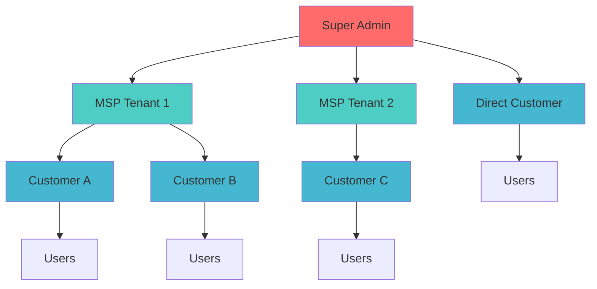
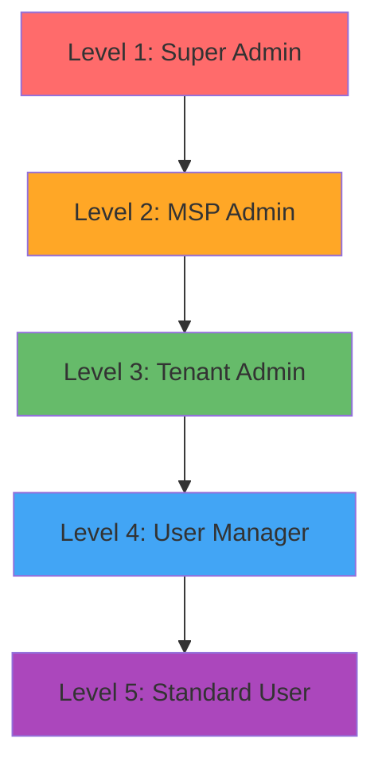

# MSP Multi-Tenant Database Schema

A comprehensive SurrealDB schema designed for Managed Service Provider (MSP) environments with hierarchical tenant management, role-based permissions, and enterprise-grade security.

## 🎯 Overview

This database schema provides a complete foundation for MSP businesses that need to manage multiple customer tenants while maintaining strict data isolation, granular permissions, and secure authentication. It supports complex organizational hierarchies from Super Admins down to individual users.

### Key Features

- **🏢 Hierarchical Tenant Structure**: Super Admin → MSP → Customer → Users
- **🔐 Role-Based Access Control**: Granular permissions with tenant-scoped access
- **🛡️ Multi-Layer Security**: Both database-level and application-level permission enforcement
- **💰 MSP Billing Support**: Built-in billing relationships and responsibility tracking
- **🔒 Enterprise Security**: Argon2 password hashing, forced password changes, audit trails
- **⚡ Performance Optimized**: Strategic indexes and efficient query patterns

## 📊 System Architecture



## 🏗️ Database Structure

### Core Tables

| Table                       | Purpose                          | Key Features                              |
| --------------------------- | -------------------------------- | ----------------------------------------- |
| `role`                      | Role definitions and permissions | Hierarchical levels, granular permissions |
| `tenant`                    | Organization/tenant management   | MSP relationships, billing settings       |
| `user`                      | User accounts and authentication | Secure passwords, tenant associations     |
| `user_role`                 | User-role assignments            | Tenant-scoped roles, audit trail          |
| `msp_customer_relationship` | MSP-customer connections         | Billing arrangements, contract terms      |
| `billing`                   | Financial management             | MSP commissions, payment tracking         |

## 🎭 Role Hierarchy

The system implements a 5-level role hierarchy with decreasing privileges:



### Role Capabilities

- **Super Admin**: Complete system control, can create MSPs and manage everything
- **MSP Admin**: Manages their MSP tenant and all customer tenants under them
- **Tenant Admin**: Full control within their specific tenant only
- **User Manager**: Can create and manage users within their tenant
- **Standard User**: Basic access, can only view/edit their own profile

## 🔐 Security Model

### Two-Layer Security Approach

1. **Database-Level Permissions**: SurrealDB table permissions automatically filter data
2. **Application-Level Functions**: Business logic validation with detailed error messages

### Permission System

Permissions follow a dot-notation pattern:

- `resource.action.scope` (e.g., `user.create.own_tenant`)
- Resources: `system`, `tenant`, `user`, `msp`, `billing`, `role`
- Actions: `create`, `update`, `delete`, `view`, `manage`
- Scopes: `all`, `own`, `own_tenant`, `customers`

## 🚀 Quick Start

### 1. Deploy the Schema

```bash
# Connect to SurrealDB and run the schema
surreal sql --conn http://localhost:8000 --user root --pass root --ns asseme --db msp < create_initial_schema.sql
```

### 2. Initial Login

The schema creates a default Super Admin:

- **Email**: `super@admin.com`
- **Password**: `TempPassword123!`
- **Status**: Must change password on first login

### 3. Create Your First MSP

Use the secure signup function to create an MSP tenant:

```sql
-- Create MSP with admin user
SELECT * FROM fn::secure_signup(
    'admin@yourmsp.com',
    'SecurePassword123!',
    'MSP',
    'Admin',
    '+1-555-0123',
    'Your MSP Company',
    'msp',
    'billing@yourmsp.com',
    '+1-555-0124',
    'super_admin',  -- parent tenant
    NONE           -- no MSP (this IS the MSP)
);
```

## 📚 Documentation Structure

- **[Core Functions Guide](./docs/functions.md)** - Complete function reference
- **[Permission System](./docs/permissions.md)** - Detailed permission documentation
- **[Role Management](./docs/roles.md)** - Role creation and assignment
- **[Tenant Management](./docs/tenants.md)** - Multi-tenant setup and management
- **[Security Guide](./docs/security.md)** - Security best practices
- **[API Examples](./docs/examples.md)** - Common usage patterns
- **[Migration Guide](./docs/migration.md)** - Upgrading and data migration

## 🛠️ Key Functions

### User Management

- `fn::create_user_with_permissions()` - Secure user creation with role validation
- `fn::update_user_with_permissions()` - Permission-checked user updates
- `fn::change_password()` - Secure password changes with validation

### Tenant Operations

- `fn::tenant_signup()` - Create new tenants with MSP relationships
- `fn::secure_signup()` - Complete tenant + admin user creation
- `fn::update_tenant_with_permissions()` - Permission-checked tenant updates

### Permission System

- `fn::has_permission()` - Check user permissions for specific actions
- `fn::get_user_accessible_tenants()` - Get tenants user can access
- `fn::can_user_manage_tenant()` - Check tenant management permissions

### Authentication

- `fn::verify_password()` - Secure password verification
- `fn::is_super_admin()` - Check super admin status

## 💡 Common Use Cases

### Creating a New Customer Under an MSP

```sql
SELECT * FROM fn::secure_signup(
    'admin@customer.com', 'TempPass123!', 'Customer', 'Admin', '+1-555-0199',
    'Customer Company', 'customer', 'billing@customer.com', NONE,
    'msp_techcorp',  -- parent MSP
    'msp_techcorp'   -- MSP for billing
);
```

### Adding Users to a Tenant

```sql
SELECT * FROM fn::create_user_with_permissions(
    'creator_user_id', 'newuser@company.com', 'TempPass123!',
    'New', 'User', '+1-555-0200', 'acme_corp', 'Standard User'
);
```

### Checking Permissions

```sql
SELECT fn::has_permission('user_id', 'user.create_own_tenant', 'tenant_id');
```

## 🏃‍♂️ Getting Started

1. **Deploy**: Run the schema script in your SurrealDB instance
2. **Login**: Use the default Super Admin credentials
3. **Setup**: Create your MSP tenants and users
4. **Integrate**: Use the provided functions in your application
5. **Customize**: Extend roles and permissions as needed

## 📋 Requirements

- SurrealDB 1.0+
- Argon2 password hashing support
- Namespace: `asseme`
- Database: `msp`

---

## 📞 Support

For detailed implementation guidance, see the documentation in the `docs/` folder or refer to the inline comments in the schema file.

This schema provides a production-ready foundation for MSP applications with enterprise-grade security and scalability built in from day one.
