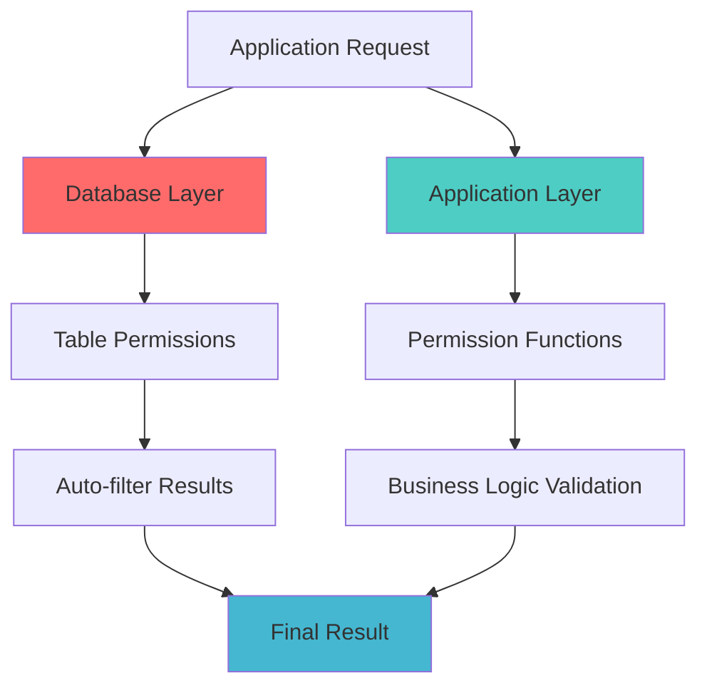
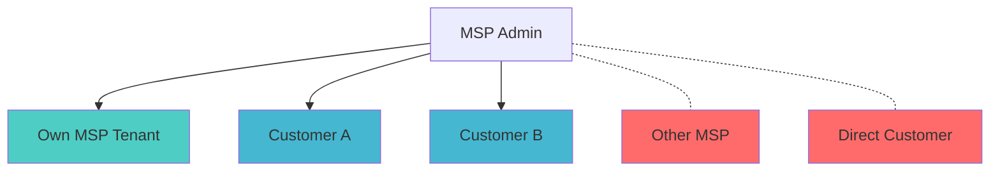
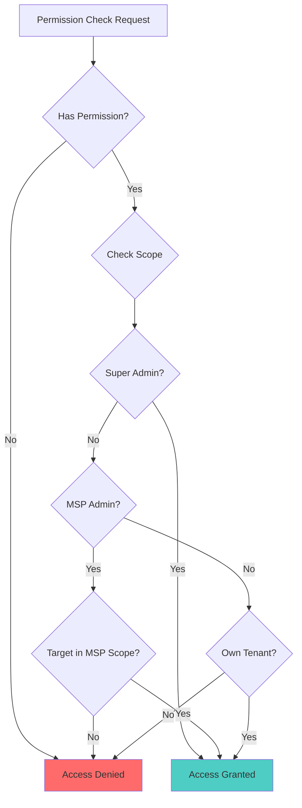

# Permission System Guide

The MSP schema implements a sophisticated permission system that provides granular access control while maintaining security and auditability.

## 🎯 Permission Philosophy

The permission system is built on three core principles:

1. **Principle of Least Privilege**: Users get only the minimum permissions needed
2. **Tenant Isolation**: Data is strictly isolated between tenants
3. **Hierarchical Access**: Higher-level roles can manage lower-level entities

## 🏗️ Permission Architecture

### Two-Layer Security Model



1. **Database-Level Permissions**: SurrealDB automatically filters queries based on table permissions
2. **Application-Level Functions**: Business logic validates complex scenarios and provides detailed error messages

## 📝 Permission Format

Permissions follow a structured dot-notation:

```
resource.action.scope
```

### Resources

- `system` - System-wide operations
- `tenant` - Tenant management
- `user` - User operations
- `msp` - MSP relationship management
- `billing` - Financial operations
- `role` - Role and permission management

### Actions

- `create` - Create new entities
- `update` - Modify existing entities
- `delete` - Remove entities
- `view` - Read/query data
- `manage` - Full administrative control

### Scopes

- `all` - Global access across all tenants
- `own` - User's own data only
- `own_tenant` - Within user's primary tenant
- `customers` - MSP's customer tenants

## 👥 Role-Based Permissions

### Super Admin (Level 1)

```json
[
  "system.manage",
  "tenant.create",
  "tenant.delete",
  "tenant.manage_all",
  "tenant.view_all",
  "user.create_all",
  "user.update_all",
  "user.delete_all",
  "user.view_all",
  "msp.create",
  "msp.update_all",
  "msp.delete_all",
  "msp.view_all",
  "billing.create_all",
  "billing.update_all",
  "billing.delete_all",
  "billing.view_all",
  "role.assign_all",
  "role.view_all",
  "super_admin.create",
  "msp_admin.create",
  "tenant_admin.create"
]
```

**Capabilities:**

- Complete system control
- Can create and manage all entity types
- Access to all tenants and data
- Can create other Super Admins

### MSP Admin (Level 2)

```json
[
  "tenant.view_own",
  "tenant.update_own",
  "tenant.view_customers",
  "tenant.update_customers",
  "user.create_customers",
  "user.update_customers",
  "user.view_customers",
  "user.delete_customers",
  "user.view_own_tenant",
  "user.update_own_tenant",
  "user.create_own_tenant",
  "msp.view_own",
  "msp.update_own",
  "msp.manage_relationships",
  "billing.view_customers",
  "billing.update_customers",
  "billing.create_customers",
  "billing.view_own",
  "billing.update_own",
  "role.assign_customers",
  "role.assign_own_tenant",
  "msp_admin.create_for_owned_tenants",
  "tenant_admin.create_customers",
  "user_manager.create_customers"
]
```

**Capabilities:**

- Manage their MSP tenant and all customer tenants
- Create and manage users for customers
- Handle billing for customer tenants
- Can create MSP Admins for owned tenants only

### Tenant Admin (Level 3)

```json
[
  "tenant.view_own",
  "tenant.update_own",
  "tenant.manage_settings",
  "user.create_own_tenant",
  "user.update_own_tenant",
  "user.view_own_tenant",
  "user.delete_own_tenant",
  "billing.view_own",
  "billing.update_own",
  "role.assign_own_tenant",
  "role.view_own_tenant",
  "tenant_admin.create_own_tenant",
  "user_manager.create_own_tenant",
  "user.create_own_tenant"
]
```

**Capabilities:**

- Full control within their tenant only
- Manage all users in their tenant
- Handle tenant settings and billing
- Can create other Tenant Admins for their tenant

### User Manager (Level 4)

```json
[
  "user.create_own_tenant",
  "user.update_own_tenant",
  "user.view_own_tenant",
  "user.delete_basic_own_tenant",
  "role.assign_basic_own_tenant",
  "role.view_own_tenant",
  "user.create_own_tenant"
]
```

**Capabilities:**

- Create and manage users within their tenant
- Cannot create administrative roles
- Limited to basic user operations

### Standard User (Level 5)

```json
["profile.edit", "profile.view", "data.view_own", "settings.view"]
```

**Capabilities:**

- Edit their own profile
- View their own data
- Basic settings access

## 🔍 Permission Checking Process

### Database-Level Filtering

When a user queries a table, SurrealDB automatically applies permission filters:

```sql
-- Example: User table permissions
DEFINE TABLE user SCHEMAFULL
    PERMISSIONS
        FOR select WHERE $auth.id = id OR
                        fn::has_permission(<string>$auth.id, 'user.view_all', NONE) OR
                        fn::has_permission(<string>$auth.id, 'user.view_own_tenant', <string>primary_tenant) OR
                        fn::has_permission(<string>$auth.id, 'user.view_customers', <string>primary_tenant)
```

This means:

- Users can always see their own record
- Users with global view permissions see all users
- Users with tenant permissions see users in their scope

### Application-Level Validation

Functions provide additional business logic:

```sql
-- Example permission check in fn::create_user_with_permissions()
LET $can_create = fn::has_permission($creator_user_id, 'user.create_own_tenant', $tenant_id) OR
                  fn::has_permission($creator_user_id, 'user.create_customers', $tenant_id) OR
                  fn::has_permission($creator_user_id, 'user.create_all', NONE);

IF !$can_create {
    THROW 'Insufficient permissions to create users in this tenant';
};
```

## 🎭 Tenant Context

Permissions are evaluated with tenant context to ensure proper isolation:

### MSP Admin Example

An MSP Admin with `user.view_customers` permission can see users from:

- Their own MSP tenant
- All customer tenants under their MSP
- NOT users from other MSPs or unrelated tenants



### Permission Evaluation Flow



## 🛡️ Security Features

### Field-Level Security

Sensitive fields have additional protection:

```sql
DEFINE FIELD password_hash ON TABLE user TYPE string ASSERT $value != NONE
    PERMISSIONS FOR select WHERE $auth.id = id;
```

Only the user themselves can see their password hash.

### Role Assignment Restrictions

The system enforces role hierarchy rules:

1. **Super Admins** can create any role
2. **MSP Admins** can create MSP Admins for owned tenants only
3. **Tenant Admins** can create Tenant Admins within their tenant
4. **Lower roles** cannot create administrative roles

### Audit Trail

All permission-sensitive operations are logged:

- Who performed the action (`granted_by` field)
- When it occurred (`granted_at` timestamp)
- What tenant it affected

## 💡 Common Permission Patterns

### Creating Users

```sql
-- Check creation permission
IF fn::has_permission($creator_id, 'user.create_own_tenant', $tenant_id) {
    -- User can create users in their tenant
}

-- Check role assignment permission
IF $role_name = 'Super Admin' AND !fn::is_super_admin($creator_id) {
    THROW 'Only Super Admins can create Super Admins';
}
```

### Viewing Data

```sql
-- Check view permission with tenant context
SELECT * FROM user WHERE fn::has_permission($user_id, 'user.view_customers', <string>primary_tenant);
```

### Updating Resources

```sql
-- Check update permission
LET $can_update = fn::has_permission($updater_id, 'tenant.update_own', $tenant_id) OR
                  fn::has_permission($updater_id, 'tenant.update_customers', $tenant_id);
```

## 🔧 Customizing Permissions

### Adding New Permissions

1. **Add to Role Definition**:

```sql
UPDATE role:tenant_admin SET permissions += ['new.permission.scope'];
```

2. **Update Permission Functions**:
   Modify `fn::has_permission()` if new logic is needed.

3. **Update Table Permissions**:
   Add new permission checks to relevant table definitions.

### Creating Custom Roles

```sql
INSERT INTO role (name, description, level, permissions) VALUES
('custom_role', 'Custom Role Description', 4, [
    'custom.permission.set'
]);
```

## ⚠️ Security Best Practices

1. **Always use permission functions** instead of bypassing with direct queries
2. **Validate tenant context** for all operations
3. **Log sensitive operations** for audit purposes
4. **Regularly review permissions** and remove unnecessary access
5. **Test permission boundaries** with different user types
6. **Use least privilege principle** when assigning roles

## 🔍 Debugging Permissions

### Check User Permissions

```sql
-- See all permissions for a user
SELECT role.permissions FROM user_role
WHERE user = user:target_user AND is_active = true;

-- Test specific permission
SELECT fn::has_permission('user_id', 'permission.string', 'tenant_id');
```

### View User's Accessible Tenants

```sql
SELECT * FROM fn::get_user_accessible_tenants('user_id');
```

### Check Role Assignments

```sql
-- See all roles for a user
SELECT role.name, tenant.name FROM user_role
WHERE user = user:target_user AND is_active = true;
```

This permission system provides enterprise-grade security while maintaining flexibility for complex organizational structures.
