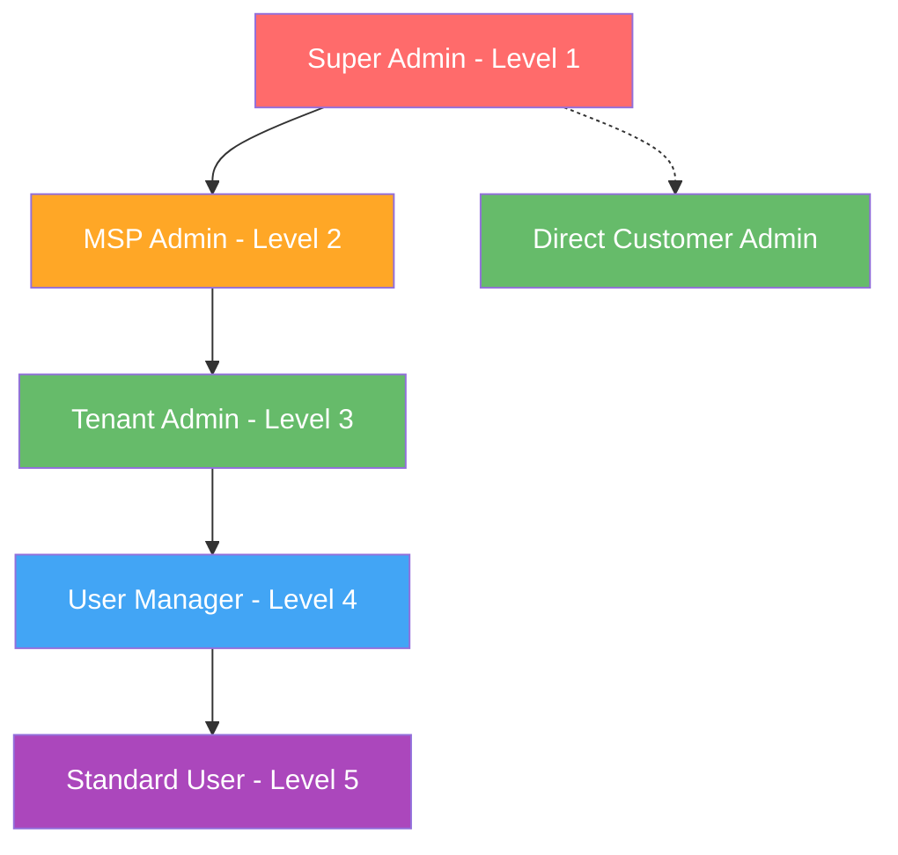
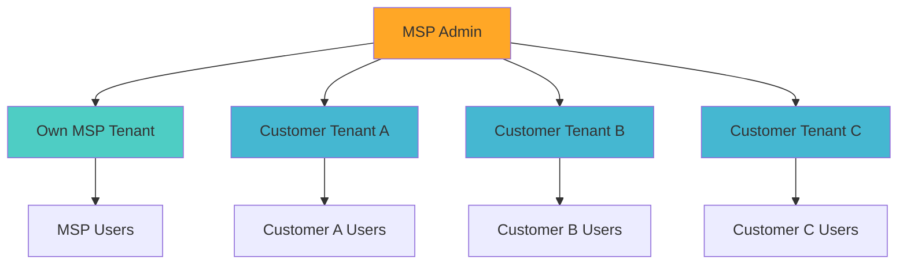
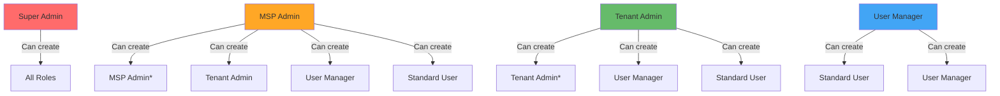

# Role Management Guide

Complete guide to understanding and managing roles in the MSP database system.

## 🎭 Role System Overview

The MSP schema implements a hierarchical role system with 5 distinct levels, each with carefully crafted permissions that ensure security while enabling organizational flexibility.

## 📊 Role Hierarchy



## 🔑 Role Definitions

### Level 1: Super Admin

**Purpose**: Ultimate system control and oversight
**Typical Users**: System owners, platform administrators
**Creation**: Can only be created by existing Super Admins

**Key Capabilities**:

- Complete system access across all tenants
- Create and manage all other role types
- Direct customer management
- MSP creation and oversight
- System-wide settings and configuration

**Permissions**:

```json
[
  "system.manage",
  "tenant.create",
  "tenant.delete",
  "tenant.manage_all",
  "tenant.view_all",
  "user.create_all",
  "user.update_all",
  "user.delete_all",
  "user.view_all",
  "msp.create",
  "msp.update_all",
  "msp.delete_all",
  "msp.view_all",
  "billing.create_all",
  "billing.update_all",
  "billing.delete_all",
  "billing.view_all",
  "role.assign_all",
  "role.view_all",
  "super_admin.create",
  "msp_admin.create",
  "tenant_admin.create"
]
```

**Use Cases**:

- Platform setup and configuration
- MSP onboarding
- Emergency access and recovery
- System maintenance and upgrades

### Level 2: MSP Admin

**Purpose**: Manage MSP business and customer relationships
**Typical Users**: MSP business owners, operations managers
**Creation**: By Super Admins or MSP Admins (for owned tenants only)

**Key Capabilities**:

- Manage their MSP tenant and all customer tenants
- Create and manage users for customer organizations
- Handle billing and financial relationships
- Establish and modify customer contracts

**Permissions**:

```json
[
  "tenant.view_own",
  "tenant.update_own",
  "tenant.view_customers",
  "tenant.update_customers",
  "user.create_customers",
  "user.update_customers",
  "user.view_customers",
  "user.delete_customers",
  "user.view_own_tenant",
  "user.update_own_tenant",
  "user.create_own_tenant",
  "msp.view_own",
  "msp.update_own",
  "msp.manage_relationships",
  "billing.view_customers",
  "billing.update_customers",
  "billing.create_customers",
  "billing.view_own",
  "billing.update_own",
  "role.assign_customers",
  "role.assign_own_tenant",
  "msp_admin.create_for_owned_tenants",
  "tenant_admin.create_customers",
  "user_manager.create_customers"
]
```

**Scope of Access**:



### Level 3: Tenant Admin

**Purpose**: Complete administrative control within a single tenant
**Typical Users**: IT managers, department heads, company administrators
**Creation**: By Super Admins, MSP Admins, or Tenant Admins (within their tenant)

**Key Capabilities**:

- Full control over their tenant's settings and configuration
- Create and manage all users within their tenant
- Handle tenant-specific billing and settings
- Assign roles to users within their tenant

**Permissions**:

```json
[
  "tenant.view_own",
  "tenant.update_own",
  "tenant.manage_settings",
  "user.create_own_tenant",
  "user.update_own_tenant",
  "user.view_own_tenant",
  "user.delete_own_tenant",
  "billing.view_own",
  "billing.update_own",
  "role.assign_own_tenant",
  "role.view_own_tenant",
  "tenant_admin.create_own_tenant",
  "user_manager.create_own_tenant",
  "user.create_own_tenant"
]
```

**Limitations**:

- Cannot access other tenants
- Cannot create MSP Admins or Super Admins
- Cannot modify MSP relationships or billing arrangements

### Level 4: User Manager

**Purpose**: User administration within a tenant
**Typical Users**: HR personnel, team leads, departmental administrators
**Creation**: By Tenant Admins or higher-level roles

**Key Capabilities**:

- Create and manage standard users
- Update user information and basic settings
- Assign basic roles (Standard User, User Manager)
- View user activity within the tenant

**Permissions**:

```json
[
  "user.create_own_tenant",
  "user.update_own_tenant",
  "user.view_own_tenant",
  "user.delete_basic_own_tenant",
  "role.assign_basic_own_tenant",
  "role.view_own_tenant",
  "user.create_own_tenant"
]
```

**Limitations**:

- Cannot create administrative roles (Tenant Admin, MSP Admin, Super Admin)
- Cannot modify tenant settings or billing
- Cannot delete administrative users

### Level 5: Standard User

**Purpose**: Basic system access for end users
**Typical Users**: Employees, regular system users
**Creation**: By any administrative role

**Key Capabilities**:

- View and edit their own profile
- Access features appropriate to their role
- View their own data and settings

**Permissions**:

```json
["profile.edit", "profile.view", "data.view_own", "settings.view"]
```

**Characteristics**:

- Cannot create or manage other users
- Cannot access administrative functions
- Limited to personal data and assigned resources

## 🔄 Role Assignment Rules

### Creation Hierarchy



_\* With restrictions: MSP Admins can only create MSP Admins for owned tenants, Tenant Admins only within their tenant_

### Assignment Validation

The system enforces strict rules during role assignment:

```sql
-- Role creation restrictions
IF $role_name = 'Super Admin' AND !fn::is_super_admin($creator_id) {
    THROW 'Only Super Admins can create Super Admins';
};

IF $role_name = 'MSP Admin' AND !($is_super_admin OR $is_msp_admin) {
    THROW 'Only Super Admins or MSP Admins can create MSP Admins';
};
```

## 🛠️ Role Management Operations

### Creating Users with Roles

```sql
-- Super Admin creates MSP Admin
SELECT * FROM fn::create_user_with_permissions(
    'super_admin',
    'msp@company.com',
    'SecurePassword123!',
    'MSP',
    'Admin',
    '+1-555-0123',
    'msp_tenant_id',
    'MSP Admin'
);

-- MSP Admin creates Tenant Admin for customer
SELECT * FROM fn::create_user_with_permissions(
    'msp_admin_id',
    'admin@customer.com',
    'SecurePassword123!',
    'Customer',
    'Admin',
    '+1-555-0456',
    'customer_tenant_id',
    'Tenant Admin'
);

-- Tenant Admin creates User Manager
SELECT * FROM fn::create_user_with_permissions(
    'tenant_admin_id',
    'manager@customer.com',
    'SecurePassword123!',
    'User',
    'Manager',
    '+1-555-0789',
    'customer_tenant_id',
    'User Manager'
);
```

### Assigning Roles to Existing Users

```sql
-- Promote user to User Manager
SELECT * FROM fn::assign_role_with_permissions(
    'tenant_admin_id',
    'existing_user_id',
    'User Manager',
    'tenant_id'
);

-- Change user role (deactivates previous role)
SELECT * FROM fn::assign_role_with_permissions(
    'msp_admin_id',
    'user_id',
    'Tenant Admin',
    'customer_tenant_id'
);
```

### Viewing Role Assignments

```sql
-- All active roles for a user
SELECT
    r.name as role_name,
    r.level,
    t.name as tenant_name,
    ur.granted_at,
    ur.granted_by.email as granted_by
FROM user_role ur
JOIN role r ON ur.role = r.id
JOIN tenant t ON ur.tenant = t.id
WHERE ur.user = user:target_user
  AND ur.is_active = true;

-- All users with a specific role
SELECT
    u.email,
    u.first_name,
    u.last_name,
    t.name as tenant_name
FROM user_role ur
JOIN user u ON ur.user = u.id
JOIN role r ON ur.role = r.id
JOIN tenant t ON ur.tenant = t.id
WHERE r.name = 'MSP Admin'
  AND ur.is_active = true;
```

## 📋 Role-Based Use Cases

### MSP Business Scenarios

**Scenario 1: New MSP Onboarding**

```sql
-- 1. Super Admin creates MSP tenant and admin
SELECT * FROM fn::secure_signup(
    'admin@newmsp.com', 'TempPass123!', 'MSP', 'Admin', '+1555123',
    'New MSP Company', 'msp', 'billing@newmsp.com', '+1555124',
    'super_admin', NONE
);

-- 2. MSP Admin adds customer
SELECT * FROM fn::secure_signup(
    'admin@customer.com', 'TempPass123!', 'Customer', 'Admin', '+1555456',
    'Customer Company', 'customer', 'billing@customer.com', '+1555457',
    'new_msp_id', 'new_msp_id'
);
```

**Scenario 2: Customer Self-Service**

```sql
-- Tenant Admin creates User Manager for HR
SELECT * FROM fn::create_user_with_permissions(
    'tenant_admin_id', 'hr@company.com', 'TempPass123!',
    'HR', 'Manager', '+1555789', 'tenant_id', 'User Manager'
);

-- HR Manager creates new employee
SELECT * FROM fn::create_user_with_permissions(
    'hr_manager_id', 'employee@company.com', 'TempPass123!',
    'New', 'Employee', '+1555999', 'tenant_id', 'Standard User'
);
```

### Permission Escalation Scenarios

**Safe Escalation**: Tenant Admin promotes User Manager

```sql
SELECT * FROM fn::assign_role_with_permissions(
    'tenant_admin_id', 'user_manager_id', 'Tenant Admin', 'tenant_id'
);
```

**Blocked Escalation**: User Manager tries to create Tenant Admin

```sql
-- This will fail with permission error
SELECT * FROM fn::create_user_with_permissions(
    'user_manager_id', 'user@company.com', 'TempPass123!',
    'New', 'Admin', '+1555888', 'tenant_id', 'Tenant Admin'
);
-- Error: Insufficient permissions
```

## 🔍 Role Auditing and Monitoring

### Regular Audit Queries

```sql
-- High-privilege role assignments in last 30 days
SELECT
    u.email,
    r.name as role,
    t.name as tenant,
    ur.granted_at,
    gb.email as granted_by
FROM user_role ur
JOIN user u ON ur.user = u.id
JOIN role r ON ur.role = r.id
JOIN tenant t ON ur.tenant = t.id
JOIN user gb ON ur.granted_by = gb.id
WHERE r.level <= 2  -- Super Admin and MSP Admin
  AND ur.granted_at > time::now() - 30d
ORDER BY ur.granted_at DESC;

-- Users with multiple active roles
SELECT
    u.email,
    COUNT(ur.role) as role_count,
    array::group(r.name) as roles
FROM user u
JOIN user_role ur ON u.id = ur.user
JOIN role r ON ur.role = r.id
WHERE ur.is_active = true
GROUP BY u.id, u.email
HAVING COUNT(ur.role) > 1;

-- Inactive users with administrative roles
SELECT
    u.email,
    r.name as role,
    u.last_login,
    t.name as tenant
FROM user u
JOIN user_role ur ON u.id = ur.user
JOIN role r ON ur.role = r.id
JOIN tenant t ON ur.tenant = t.id
WHERE ur.is_active = true
  AND r.level <= 3  -- Administrative roles
  AND (u.last_login IS NULL OR u.last_login < time::now() - 90d);
```

### Role Analytics

```sql
-- Role distribution across tenants
SELECT
    t.name as tenant_name,
    t.tenant_type,
    r.name as role_name,
    COUNT(ur.user) as user_count
FROM tenant t
LEFT JOIN user_role ur ON t.id = ur.tenant AND ur.is_active = true
LEFT JOIN role r ON ur.role = r.id
GROUP BY t.id, t.name, t.tenant_type, r.id, r.name
ORDER BY t.tenant_type, t.name, r.level;
```

## ⚠️ Role Security Best Practices

### 1. Minimum Viable Privilege

Always assign the lowest role that provides necessary access:

- Use Standard User for regular employees
- Reserve administrative roles for actual administrators
- Regularly review and downgrade unnecessary privileges

### 2. Regular Role Reviews

- Monthly review of all administrative roles
- Quarterly audit of role assignments
- Annual comprehensive permission analysis

### 3. Role Lifecycle Management

- Immediate role deactivation upon employee departure
- Regular cleanup of dormant accounts
- Proper handover procedures for role transfers

### 4. Segregation of Duties

- Separate creation and approval workflows for sensitive roles
- Multiple approvers for Super Admin creation
- Clear escalation paths for emergency access

This role system provides the flexibility needed for complex MSP environments while maintaining strict security boundaries and clear accountability.
