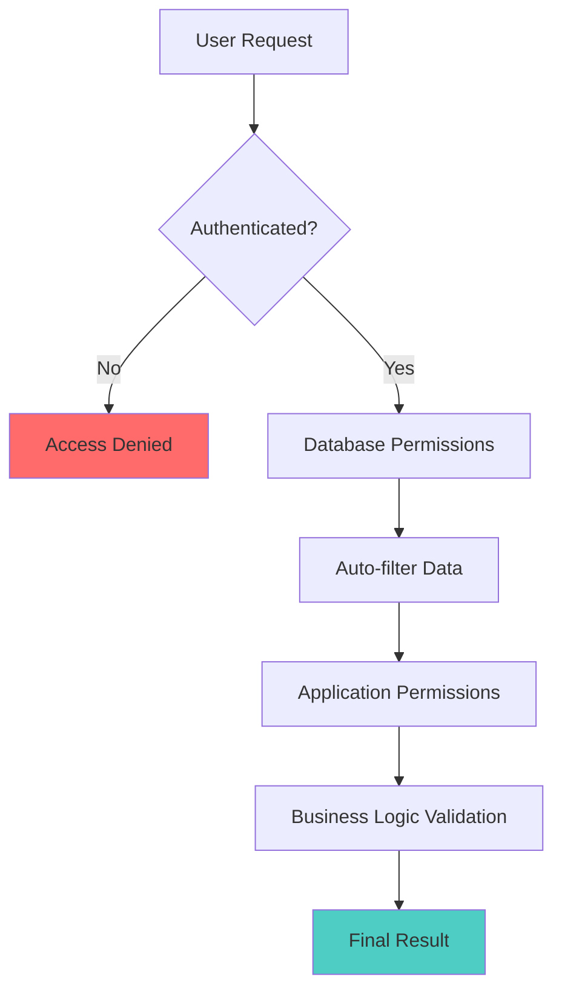

# Security Guide

This guide covers the security features and best practices for the MSP database schema.

## 🛡️ Security Overview

The MSP schema implements enterprise-grade security through multiple layers:

1. **Authentication Security** - Argon2 password hashing, forced password changes
2. **Authorization Security** - Role-based permissions with tenant isolation
3. **Data Security** - Field-level access controls and automatic data filtering
4. **Audit Security** - Complete operation logging and trail maintenance

## 🔐 Authentication Security

### Password Security

The system uses **Argon2** for password hashing, which is recommended by security experts:

```sql
-- Password hashing during user creation
password_hash = crypto::argon2::generate($password)

-- Password verification during login
crypto::argon2::compare($password, $stored_hash)
```

**Argon2 Benefits:**

- Resistant to GPU-based attacks
- Memory-hard function
- Configurable time and memory costs
- Winner of the Password Hashing Competition

### Forced Password Changes

```sql
-- Default behavior for new users
password_must_change: true

-- Admin can force password change
UPDATE user SET password_must_change = true WHERE id = user:target;
```

### Password Policy Enforcement

While not enforced at database level, recommended policies include:

- Minimum 12 characters
- Mix of uppercase, lowercase, numbers, symbols
- No common passwords or dictionary words
- Regular password rotation

## 🔒 Authorization Security

### Multi-Layer Permission System



### Role-Based Access Control (RBAC)

Each role has strictly defined permissions:

```sql
-- Example: MSP Admin permissions
[
    "tenant.view_own", "tenant.update_own",
    "tenant.view_customers", "tenant.update_customers",
    "user.create_customers", "user.update_customers",
    "msp.manage_relationships"
]
```

### Tenant Isolation

Data is automatically isolated by tenant context:

```sql
-- Users can only see data in their accessible tenants
FOR select WHERE $auth.id = id OR
                fn::has_permission(<string>$auth.id, 'user.view_own_tenant', <string>primary_tenant)
```

## 🔍 Data Security

### Field-Level Security

Sensitive fields have additional protection:

```sql
-- Password hashes only visible to the user themselves
DEFINE FIELD password_hash ON TABLE user TYPE string ASSERT $value != NONE
    PERMISSIONS FOR select WHERE $auth.id = id;
```

### Automatic Data Filtering

The database automatically filters query results based on permissions:

```sql
-- MSP Admin query automatically filtered to show only accessible users
SELECT * FROM user;  -- Only returns users from MSP and customer tenants
```

### Secure Defaults

- All tables use `SCHEMAFULL` for strict data validation
- Permission defaults to `NONE` (deny all) unless explicitly granted
- Required fields use `ASSERT $value != NONE`
- Email validation with `string::is::email($value)`

## 🔎 Audit Security

### Operation Logging

All security-sensitive operations are logged:

```sql
-- User role assignments track who, when, and by whom
DEFINE FIELD granted_by ON TABLE user_role TYPE record<user>;
DEFINE FIELD granted_at ON TABLE user_role TYPE datetime DEFAULT time::now();
```

### Audit Queries

```sql
-- Track all role assignments
SELECT
    ur.user.email as user_email,
    r.name as role_assigned,
    t.name as tenant_name,
    ur.granted_by.email as granted_by,
    ur.granted_at
FROM user_role ur
JOIN role r ON ur.role = r.id
JOIN tenant t ON ur.tenant = t.id
ORDER BY ur.granted_at DESC;

-- Monitor Super Admin creations
SELECT
    u.email,
    u.created_at,
    ur.granted_by.email as created_by
FROM user u
JOIN user_role ur ON u.id = ur.user
JOIN role r ON ur.role = r.id
WHERE r.name = 'Super Admin'
ORDER BY u.created_at DESC;
```

## ⚠️ Security Best Practices

### 1. Principle of Least Privilege

Always assign the minimum role necessary:

```sql
-- ❌ Don't assign Tenant Admin for basic users
-- ✅ Use Standard User role for regular users
SELECT * FROM fn::create_user_with_permissions(
    'creator_id', 'user@company.com', 'password',
    'John', 'Doe', '+1555123', 'tenant_id', 'Standard User'
);
```

### 2. Regular Permission Audits

```sql
-- Review high-privilege roles monthly
SELECT
    u.email,
    r.name as role,
    t.name as tenant,
    ur.granted_at
FROM user_role ur
JOIN user u ON ur.user = u.id
JOIN role r ON ur.role = r.id
JOIN tenant t ON ur.tenant = t.id
WHERE r.level <= 2  -- Super Admin and MSP Admin
  AND ur.is_active = true
ORDER BY ur.granted_at DESC;
```

### 3. Secure Function Usage

Always use permission-checking functions:

```sql
-- ❌ Direct table access bypasses security
UPDATE user SET first_name = 'Updated';

-- ✅ Use permission-checking functions
SELECT * FROM fn::update_user_with_permissions(
    'updater_id', 'target_id', { first_name: 'Updated' }
);
```

### 4. Input Validation

Validate all inputs before function calls:

```sql
-- Email validation
ASSERT string::is::email($email);

-- Password strength (implement in application)
ASSERT string::len($password) >= 12;

-- Prevent injection attacks
ASSERT !string::contains($input, '<script>');
```

### 5. Secure Connections

- Always use HTTPS for database connections
- Use proper authentication tokens
- Implement connection encryption
- Regular certificate rotation

## 🚨 Threat Protection

### SQL Injection Prevention

SurrealDB's parameterized queries and type system prevent SQL injection:

```sql
-- Safe: Parameterized query
SELECT * FROM user WHERE email = $email;

-- Dangerous: String concatenation (avoid in application layer)
-- SELECT * FROM user WHERE email = '" + userInput + "'";
```

### Privilege Escalation Prevention

Role hierarchy prevents unauthorized privilege escalation:

```sql
-- MSP Admins cannot create Super Admins
IF $role_name = 'Super Admin' AND !fn::is_super_admin($creator_id) {
    THROW 'Only Super Admins can create Super Admins';
};
```

### Data Exfiltration Prevention

Tenant isolation prevents cross-tenant data access:

```sql
-- Automatic filtering ensures users only see authorized data
SELECT * FROM billing
WHERE fn::has_permission($user_id, 'billing.view_customers', <string>tenant);
```

## 🔧 Security Configuration

### Database-Level Security

```sql
-- Secure namespace and database setup
DEFINE NAMESPACE asseme COMMENT "Secure MSP namespace";
DEFINE DATABASE msp COMMENT "MSP database with security";

-- Root access restriction (configure in deployment)
-- Use specific user accounts instead of root for applications
```

### Application-Level Security

```typescript
// Example secure application configuration
const surrealConfig = {
  host: 'wss://secure-db.example.com',
  namespace: 'asseme',
  database: 'msp',
  // Use scope-based authentication
  scope: 'user_scope',
  // Enable automatic token refresh
  autoRefresh: true,
  // Set secure session timeout
  sessionTimeout: '24h'
}
```

### Environment Security

- Store credentials in secure environment variables
- Use proper secret management systems
- Regular credential rotation
- Network isolation and firewalls
- Regular security updates

## 🔍 Security Monitoring

### Real-Time Monitoring

```sql
-- Monitor failed authentication attempts
-- (Implement in application layer)

-- Track permission violations
-- (Log when functions throw permission errors)

-- Monitor bulk operations
SELECT COUNT(*) FROM user WHERE created_at > time::now() - 1h;
```

### Security Alerts

Set up alerts for:

- Multiple failed login attempts
- Privilege escalation attempts
- Bulk data access patterns
- Super Admin account usage
- Off-hours administrative activities

## 🆘 Incident Response

### Security Incident Checklist

1. **Immediate Response**:
   - Disable compromised accounts
   - Revoke suspicious sessions
   - Document incident timeline

2. **Investigation**:
   - Query audit logs
   - Identify affected data
   - Determine attack vector

3. **Containment**:
   - Patch vulnerabilities
   - Reset credentials
   - Update permissions

4. **Recovery**:
   - Restore from clean backups
   - Verify system integrity
   - Monitor for recurrence

### Useful Incident Queries

```sql
-- Find recent privilege changes
SELECT * FROM user_role
WHERE granted_at > time::now() - 24h
ORDER BY granted_at DESC;

-- Identify dormant Super Admins
SELECT u.* FROM user u
JOIN user_role ur ON u.id = ur.user
JOIN role r ON ur.role = r.id
WHERE r.name = 'Super Admin'
  AND u.last_login < time::now() - 90d;

-- Check for users with multiple high-privilege roles
SELECT
    u.email,
    COUNT(ur.role) as role_count
FROM user u
JOIN user_role ur ON u.id = ur.user
JOIN role r ON ur.role = r.id
WHERE r.level <= 2 AND ur.is_active = true
GROUP BY u.id, u.email
HAVING COUNT(ur.role) > 1;
```

## 📋 Security Checklist

### Deployment Security

- [ ] Database access restricted to authorized networks
- [ ] Strong root credentials configured
- [ ] SSL/TLS certificates properly configured
- [ ] Regular backups encrypted and tested
- [ ] Monitoring and alerting configured

### Application Security

- [ ] Permission functions used throughout application
- [ ] Input validation implemented
- [ ] Error handling doesn't leak sensitive information
- [ ] Session management properly configured
- [ ] Regular security testing performed

### Operational Security

- [ ] Regular permission audits scheduled
- [ ] Password policies enforced
- [ ] User access reviews conducted
- [ ] Security incident response plan documented
- [ ] Staff security training completed

This comprehensive security model ensures your MSP system is protected against common threats while maintaining usability and performance.
