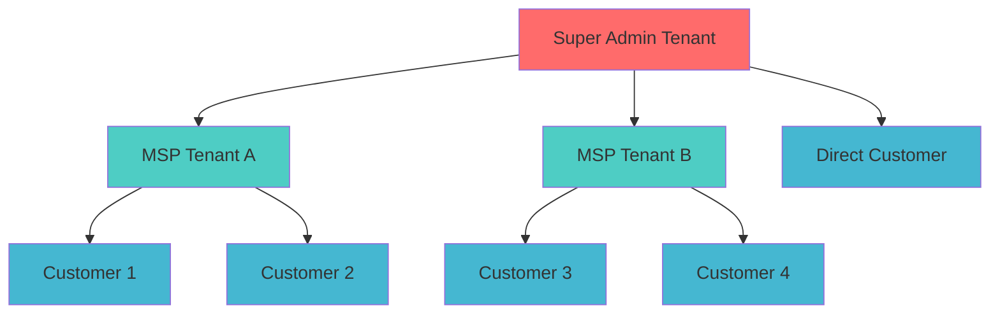
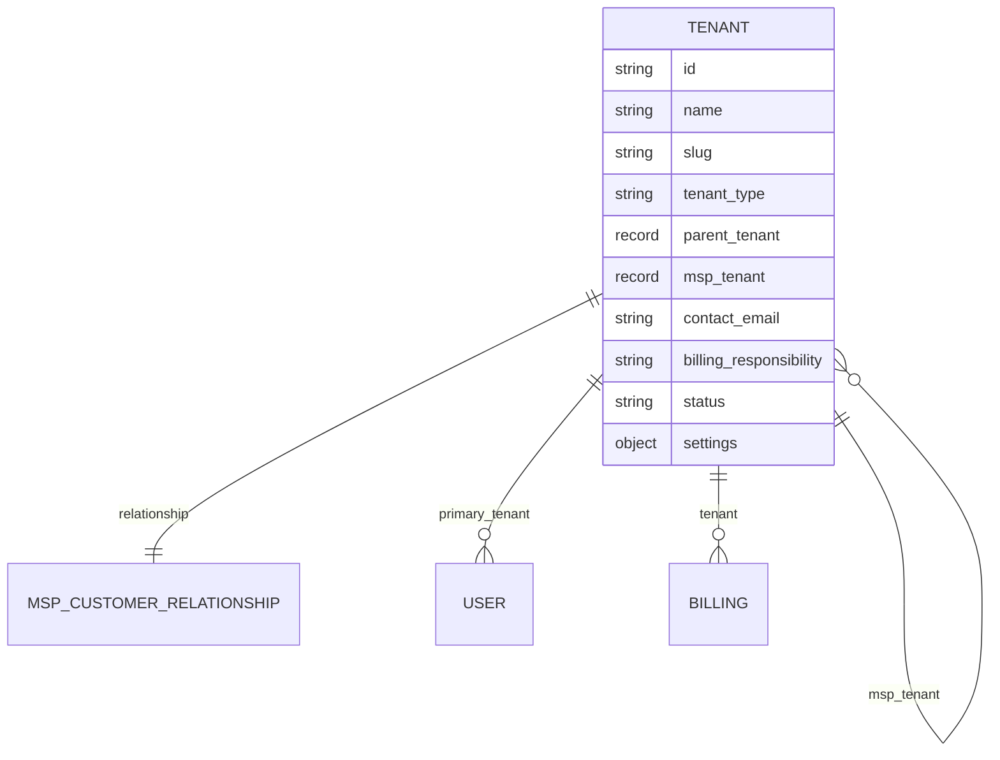
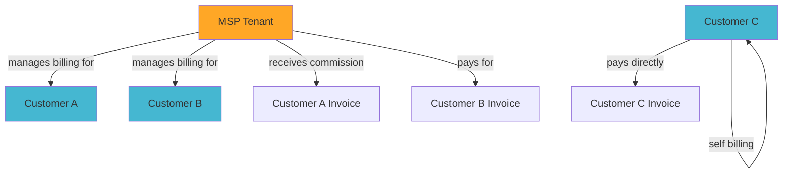

# Tenant Management Guide

Comprehensive guide to managing the multi-tenant architecture in the MSP database system.

## 🏢 Tenant Architecture Overview

The MSP system supports a flexible hierarchical tenant structure that can accommodate various business models:



## 🏗️ Tenant Types

### Super Admin Tenant

- **Purpose**: System administration and control
- **Characteristics**: Single tenant at the root level
- **Users**: Platform administrators, system owners
- **Access**: Global access to all tenants

### MSP Tenant

- **Purpose**: Managed Service Provider organizations
- **Characteristics**: Can have multiple customer tenants
- **Users**: MSP staff, account managers, technicians
- **Access**: Own tenant + all customer tenants

### Customer Tenant

- **Purpose**: End-customer organizations
- **Characteristics**: Can be under an MSP or direct
- **Users**: Customer employees, admins, users
- **Access**: Own tenant only

## 📊 Tenant Data Structure

### Core Tenant Fields

```sql
DEFINE TABLE tenant SCHEMAFULL;
DEFINE FIELD name ON TABLE tenant TYPE string ASSERT $value != NONE;
DEFINE FIELD slug ON TABLE tenant TYPE string ASSERT $value != NONE;
DEFINE FIELD tenant_type ON TABLE tenant TYPE string ASSERT $value IN ['super_admin', 'msp', 'customer'];
DEFINE FIELD parent_tenant ON TABLE tenant TYPE option<record<tenant>>;
DEFINE FIELD msp_tenant ON TABLE tenant TYPE option<record<tenant>>;
DEFINE FIELD contact_email ON TABLE tenant TYPE string;
DEFINE FIELD contact_phone ON TABLE tenant TYPE option<string>;
DEFINE FIELD billing_enabled ON TABLE tenant TYPE bool DEFAULT true;
DEFINE FIELD billing_responsibility ON TABLE tenant TYPE string ASSERT $value IN ['self', 'msp', 'parent'];
DEFINE FIELD status ON TABLE tenant TYPE string ASSERT $value IN ['active', 'suspended', 'inactive'];
DEFINE FIELD settings ON TABLE tenant TYPE object DEFAULT {};
```

### Tenant Relationships



## 🚀 Tenant Creation

### Creating MSP Tenants

```sql
-- Method 1: Using secure_signup (recommended)
SELECT * FROM fn::secure_signup(
    'admin@msp-company.com',
    'SecurePassword123!',
    'MSP',
    'Administrator',
    '+1-555-MSP-MAIN',
    'MSP Company Name',
    'msp',
    'billing@msp-company.com',
    '+1-555-MSP-BILL',
    'super_admin',  -- Parent tenant
    NONE           -- No MSP (this IS the MSP)
);

-- Method 2: Separate tenant and user creation
SELECT * FROM fn::tenant_signup(
    'MSP Company Name',
    'admin@msp-company.com',
    'msp',
    'super_admin',
    NONE
);
```

### Creating Customer Tenants

```sql
-- Customer under MSP
SELECT * FROM fn::secure_signup(
    'admin@customer.com',
    'CustomerPassword123!',
    'Customer',
    'Admin',
    '+1-555-CUSTOMER',
    'Customer Company Inc',
    'customer',
    'billing@customer.com',
    '+1-555-CUST-BILL',
    'msp_techcorp',  -- Parent MSP
    'msp_techcorp'   -- MSP handles billing
);

-- Direct customer (no MSP)
SELECT * FROM fn::secure_signup(
    'admin@directcustomer.com',
    'DirectPassword123!',
    'Direct',
    'Admin',
    '+1-555-DIRECT',
    'Direct Customer Corp',
    'customer',
    'billing@directcustomer.com',
    '+1-555-DIRECT-BILL',
    'super_admin',  -- Direct under super admin
    NONE           -- No MSP
);
```

## 🔧 Tenant Configuration

### Tenant Settings

The `settings` field allows flexible configuration:

```sql
-- Update tenant settings
SELECT * FROM fn::update_tenant_with_permissions(
    'admin_user_id',
    'tenant_id',
    {
        settings: {
            features: {
                advanced_reporting: true,
                api_access: true,
                custom_branding: true
            },
            limits: {
                max_users: 100,
                storage_gb: 1000,
                api_calls_per_month: 10000
            },
            branding: {
                logo_url: "https://customer.com/logo.png",
                primary_color: "#007bff",
                company_name: "Customer Company Inc"
            },
            integrations: {
                sso_enabled: true,
                slack_webhook: "https://hooks.slack.com/...",
                email_provider: "sendgrid"
            }
        }
    }
);
```

### Billing Configuration

```sql
-- Configure billing responsibility
UPDATE tenant SET
    billing_responsibility = 'msp',
    billing_enabled = true
WHERE id = tenant:customer_corp;

-- Set up MSP billing relationship
INSERT INTO msp_customer_relationship (
    msp_tenant,
    customer_tenant,
    relationship_type,
    billing_arrangement,
    commission_rate,
    contract_start,
    contract_end
) VALUES (
    tenant:msp_techcorp,
    tenant:customer_corp,
    'managed',
    'msp_pays',
    0.15,
    time::now(),
    time::now() + 365d
);
```

## 📈 Tenant Hierarchy Management

### Viewing Tenant Relationships

```sql
-- Complete tenant hierarchy
SELECT
    t.name as tenant_name,
    t.tenant_type,
    pt.name as parent_name,
    mt.name as msp_name,
    t.billing_responsibility
FROM tenant t
LEFT JOIN tenant pt ON t.parent_tenant = pt.id
LEFT JOIN tenant mt ON t.msp_tenant = mt.id
ORDER BY t.tenant_type, t.name;

-- MSP's customers
SELECT
    c.name as customer_name,
    c.contact_email,
    c.status,
    rel.relationship_type,
    rel.billing_arrangement,
    rel.commission_rate
FROM tenant msp
JOIN msp_customer_relationship rel ON msp.id = rel.msp_tenant
JOIN tenant c ON rel.customer_tenant = c.id
WHERE msp.id = tenant:msp_techcorp;
```

### Tenant Access Control

```sql
-- Get tenants accessible by user
SELECT * FROM fn::get_user_accessible_tenants('user_id');

-- Check if user can manage specific tenant
SELECT fn::can_user_manage_tenant('user_id', 'tenant_id');

-- Get users with access to tenant
SELECT
    u.email,
    u.first_name,
    u.last_name,
    r.name as role
FROM user u
JOIN user_role ur ON u.id = ur.user
JOIN role r ON ur.role = r.id
WHERE ur.tenant = tenant:target_tenant
  AND ur.is_active = true;
```

## 💰 Billing and Financial Management

### Billing Relationships



### Billing Operations

```sql
-- Create billing record
INSERT INTO billing (
    tenant,
    responsible_party,
    billing_period_start,
    billing_period_end,
    amount,
    currency,
    status,
    invoice_number,
    msp_commission,
    payment_due_date
) VALUES (
    tenant:customer_corp,      -- Service recipient
    tenant:msp_techcorp,       -- Who pays
    '2024-01-01T00:00:00Z',
    '2024-01-31T23:59:59Z',
    1500.00,
    'USD',
    'pending',
    'INV-2024-001',
    225.00,                    -- 15% commission
    '2024-02-15T00:00:00Z'
);

-- MSP billing summary
SELECT
    responsible_party.name as payer,
    tenant.name as service_recipient,
    SUM(amount) as total_amount,
    SUM(msp_commission) as total_commission
FROM billing
WHERE billing_period_start >= '2024-01-01T00:00:00Z'
  AND billing_period_end <= '2024-01-31T23:59:59Z'
  AND (responsible_party = tenant:msp_techcorp
       OR tenant IN (SELECT customer_tenant FROM msp_customer_relationship WHERE msp_tenant = tenant:msp_techcorp))
GROUP BY responsible_party, tenant;
```

## 🔄 Tenant Lifecycle Management

### Tenant Activation

```sql
-- Activate new tenant
SELECT * FROM fn::update_tenant_with_permissions(
    'admin_user_id',
    'tenant_id',
    {
        status: 'active',
        billing_enabled: true
    }
);
```

### Tenant Suspension

```sql
-- Suspend tenant (stops billing, disables access)
SELECT * FROM fn::update_tenant_with_permissions(
    'admin_user_id',
    'tenant_id',
    {
        status: 'suspended'
    }
);

-- Disable all users in suspended tenant
UPDATE user SET is_active = false
WHERE primary_tenant = tenant:suspended_tenant;
```

### Tenant Migration

```sql
-- Move customer from one MSP to another
BEGIN TRANSACTION;

-- Update tenant relationships
UPDATE tenant
SET parent_tenant = tenant:new_msp,
    msp_tenant = tenant:new_msp
WHERE id = tenant:customer_to_move;

-- Update MSP relationship
UPDATE msp_customer_relationship
SET msp_tenant = tenant:new_msp
WHERE customer_tenant = tenant:customer_to_move;

-- Update billing responsibility
UPDATE billing
SET responsible_party = tenant:new_msp
WHERE tenant = tenant:customer_to_move
  AND status IN ['draft', 'pending'];

COMMIT TRANSACTION;
```

## 📊 Tenant Analytics and Reporting

### Tenant Metrics

```sql
-- Active tenants by type
SELECT
    tenant_type,
    COUNT(*) as tenant_count,
    COUNT(CASE WHEN status = 'active' THEN 1 END) as active_count
FROM tenant
GROUP BY tenant_type;

-- User distribution across tenants
SELECT
    t.name as tenant_name,
    t.tenant_type,
    COUNT(u.id) as user_count,
    COUNT(CASE WHEN u.is_active = true THEN 1 END) as active_users
FROM tenant t
LEFT JOIN user u ON t.id = u.primary_tenant
GROUP BY t.id, t.name, t.tenant_type
ORDER BY user_count DESC;

-- MSP performance metrics
SELECT
    msp.name as msp_name,
    COUNT(rel.customer_tenant) as customer_count,
    SUM(CASE WHEN c.status = 'active' THEN 1 ELSE 0 END) as active_customers,
    AVG(rel.commission_rate) as avg_commission_rate
FROM tenant msp
LEFT JOIN msp_customer_relationship rel ON msp.id = rel.msp_tenant
LEFT JOIN tenant c ON rel.customer_tenant = c.id
WHERE msp.tenant_type = 'msp'
GROUP BY msp.id, msp.name;
```

### Growth Analytics

```sql
-- Tenant creation timeline
SELECT
    DATE_TRUNC('month', created_at) as month,
    tenant_type,
    COUNT(*) as new_tenants
FROM tenant
WHERE created_at >= '2024-01-01T00:00:00Z'
GROUP BY month, tenant_type
ORDER BY month, tenant_type;

-- Customer churn analysis
SELECT
    DATE_TRUNC('month', updated_at) as month,
    COUNT(CASE WHEN status = 'inactive' THEN 1 END) as churned_customers,
    COUNT(CASE WHEN status = 'active' THEN 1 END) as retained_customers
FROM tenant
WHERE tenant_type = 'customer'
  AND updated_at >= '2024-01-01T00:00:00Z'
GROUP BY month
ORDER BY month;
```

## 🛠️ Advanced Tenant Management

### Custom Tenant Types

You can extend the tenant system for specific use cases:

```sql
-- Add custom tenant type (requires schema modification)
-- Example: 'partner', 'reseller', 'subsidiary'

-- Create partner relationship
INSERT INTO tenant (
    name,
    slug,
    tenant_type,
    parent_tenant,
    contact_email,
    billing_responsibility
) VALUES (
    'Partner Company',
    'partner-company',
    'partner',  -- Custom type
    tenant:super_admin,
    'admin@partner.com',
    'self'
);
```

### Tenant Templates

```sql
-- Define tenant creation template
DEFINE FUNCTION fn::create_tenant_from_template($template_name: string, $tenant_data: object) {
    LET $template = SELECT * FROM tenant_template WHERE name = $template_name;

    -- Create tenant with template settings
    LET $tenant = CREATE tenant SET
        name = $tenant_data.name,
        slug = string::lowercase(string::replace($tenant_data.name, ' ', '-')),
        tenant_type = $template[0].tenant_type,
        settings = $template[0].default_settings,
        contact_email = $tenant_data.contact_email;

    RETURN $tenant;
};
```

### Bulk Tenant Operations

```sql
-- Bulk update tenant settings
FOR $tenant IN (SELECT * FROM tenant WHERE tenant_type = 'customer') {
    UPDATE $tenant.id SET settings.features.new_feature = true;
};

-- Bulk billing update
UPDATE billing
SET currency = 'EUR'
WHERE tenant IN (SELECT id FROM tenant WHERE msp_tenant = tenant:eu_msp);
```

## ⚠️ Tenant Security Considerations

### Data Isolation

- Automatic filtering ensures users only see their accessible tenants
- Cross-tenant data access is prevented at the database level
- Sensitive tenant data is protected by field-level permissions

### Tenant-Scoped Operations

```sql
-- All operations respect tenant boundaries
SELECT * FROM user
WHERE fn::has_permission($auth.id, 'user.view_customers', <string>primary_tenant);
```

### Audit Trail

```sql
-- Track tenant modifications
SELECT
    t.name as tenant_name,
    'updated' as action,
    t.updated_at,
    ur.granted_by.email as updated_by
FROM tenant t
JOIN user_role ur ON ur.tenant = t.id
WHERE t.updated_at > time::now() - 24h
ORDER BY t.updated_at DESC;
```

This tenant management system provides the flexibility and security needed for complex MSP environments while maintaining clear boundaries and proper access controls.
